  

# Hi, I'm Thanawut Suka 👋

**AI Automation Engineer · System Designer**

I design end-to-end business systems and build them with AI. I map how people actually work, define the architecture and business rules, and direct an AI coding agent (Claude) to write the code. Then I review, test and run it in production.

ออกแบบระบบงานทั้งก้อน แล้วใช้ AI สร้างให้ใช้งานจริง: ตั้งแต่คุยกับผู้ใช้หน้างาน ออกแบบสถาปัตยกรรมและกติกาธุรกิจ ไปจนถึงทดสอบ ขึ้นระบบ และดูแลต่อ

---

### What I've built

**📦 LINE-to-ERP automation platform for a construction company** — [case study →](https://github.com/earnloj-it/line-erp-automation-case-study)

- **1,600+ ERP documents** created from LINE in the first 3 months, across 7 document types (purchase, receiving, rental, vehicle, fuel)
- **42 site users · 25 active projects · 19,000+ budget lines** under automatic cost control
- Budget gate that blocks over-budget or off-BOQ orders *before* they reach the approver
- AI vision (Gemini) reads fuel bills, delivery slips and concrete tickets, and rejects bad photos with a reason
- Dashboards for accounting, QS, store and management

**🏭 Company website demo: PIKUL Precision Parts** — [live site →](https://earnloj-it.github.io/pikul-precision-demo/) · [code](https://github.com/earnloj-it/pikul-precision-demo)

- Multi-page site for a fictional CNC and sheet-metal manufacturer, with a Thai / English switch
- A quick quote on the home page carries over to the full quote form, which has drawing upload
- Mobile-ready and accessible; plain HTML/CSS/JS on GitHub Pages

### How I work with AI

| I own | AI (Claude) does |
|---|---|
| Requirements with real users (site staff, accounting, QS) | Writes the code: workflows, SQL, PHP, forms |
| System architecture & data model | Drafts migrations, scripts and patches |
| Business rules (budget, approvals, edge cases) | Explores the codebase and APIs |
| Review, testing, production rollout, rollback plans | Speeds up debugging |

### Tools

| Area | Tools |
|---|---|
| AI | Claude Code (AI-assisted development), Google Gemini (OCR / vision) |
| Automation | n8n (self-hosted), REST API integration |
| Data & backend | PostgreSQL, Docker, PHP / Laravel, Python |
| Frontend | LINE LIFF, Flex Messages, Rich Menu |
| Ops | Linux server deploy, scheduled jobs, backups |

---

📫 thanawut_s@kkumail.com
